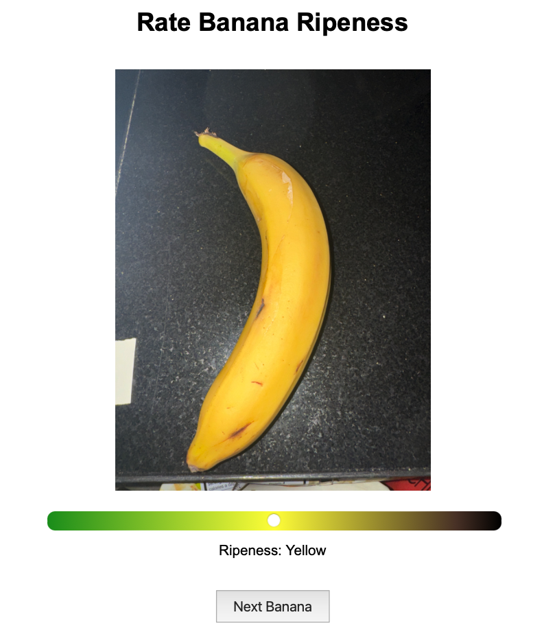

```{r child="2-permutation_test.Rmd", include = FALSE}
```


# Introduction

One of the most common household tricks for accelerating the ripening of fruit is to place it in a brown paper bag. The argument goes that there is a cyclical mechanism in which ripening plants reduce ethylene gas which is then trapped by the paper bag, accelerating the ripening process further. If this argument is correct, storing ripening fruit in a variety of containers should accelerate the ripening process, albeit possibly to varying degrees.

Given this household folklore, we were interested in investigating how much veracity there is to this trick. Specifically, we wanted to investigate the following question: *does the storage of bananas in containers such as brown paper bags and plastic kitchen bags, increase the amount of ripening that occurs over the span of four days, all else being equal with standard kitchen characteristics (e.g. lighting, temperature, humidity)?*

# Experimental Design

 We began by purchasing 30 visibly comparable (in terms of ripeness, as determined by color) bananas from a Meijer grocery store. We then weighed and recorded the mass of each banana, matching them into triplets based on their weight such that the heaviest three bananas were in a triplet, the next heaviest three in another, and so on. In this way, we are able to control for unwanted variability in ripening speed that may be due to the mass of the banana rather than the treatment assignment. 
 
 With this done, we used the R programming language to assign our three possible treatments (0: control, no container; 1: treatment, paper bag; 2: treatment, plastic Ziploc bag) uniformly at random within each triplet, with a random seed fixed for reproducibility. Both the data and code for treatment assignment, as well as the subsequent measurement process and analysis can be found at [this Github repository](https://github.com/Rosey1021/STATS-604-Project-3).

Pre-treatment ripeness measurements were taken using banana color as a proxy for ripeness. To do so, we invited a blinded third-party who was unaware of the treatment assignment to preview randomly shuffled images of the bananas. The photographs were taken all on the same phone (an iPhone 15 Pro Max), using flash and default camera settings with the same camera location and lighting to ensure consistency across images. These images were presented along with a slider with a color gradient background. The color gradient has a darkish green on the left side, a yellow directly in the middle, and a black on the right. The ripeness scores for these given colors would be mapped to a value between 0 and 100. The interface was presented to the rater with the instructions to match color of the banana to the respective color on the slider. The only additional instruction that was given to the rater was to try to be as consistent in their rating as possible. An image of interface used for rating the bananas can be seen in Figure \@ref(fig:tester).

The bananas were then assigned to their various treatments (i.e. sealed into Ziploc bags, left in brown paper bags, or left out) and placed on the same kitchen counter, ensuring that all units received exposure to typical ripening conditions (such as humidity, temperature, and lighting) which did not vary based on treatment assignment. After four days, photographs were taken again in a similar manner and presented with blinding to the same third-party individual for rating.

With the data collected, we were able to perform statistical inference to answer our research question, as detailed in the following section.

```{r tester, fig.align='center', echo=FALSE, fig.cap='Screenshot of the ripeness tester. An unlabeled banana image was presented with color gradient directly below it.', out.width = '80%'}

```

# Methods

To answer the research question, we will do three pre-specified hypothesis tests using permutation tests. The three null hypotheses are as follows:

* $H_{0,1}$ = There is no difference in the ripening speed between using paper bag and no bag 

* $H_{0,2}$ = There is no difference in the ripening speed between using plastic bag and no bag

* $H_{0,3}$ = There is no difference in the ripening speed between using paper bag and plastic bag 

Corresponding to each null hypothesis, we will run a different permutation test. For each banana, we will calculate the difference between post-treatment and pre-treatment ripeness ratings. Since the experiment was run over a fixed period, this will act as our measure of ripening speed. We will use the difference in means statistic as the test statistic. For each permutation test, we will only take the subset of the data that corresponds to the pair of interest and permute the labels in that subset. We will calculate the observed difference in means between the two groups and then permute the treatment assignments to generate a distribution of differences in means under the null hypothesis. We will then calculate the p-value under a two-sided test, and determine its significance using $\alpha = 0.5$ under a Bonferroni correction.

# Results

We observe that the difference in means of the ripening speed between paper bag and control is 1.8, resulting in a p-value of 0.616, which is not significant under the specified significance level. The resulting null distribution can be seen in Figure \@ref(fig:test-1). 

```{r test-1, fig.align='center', echo=FALSE, fig.cap=paste("Null distribution generated under $H_{0,1}$ (p-value =", signif(p_value_1, 3), ").", sep = ''), out.width = '60%'}
print(plot_1)
```


For the remaining two hypothesis tests, we see statistically significant results under our testing framework. For the second test, as seen in Figure \@ref(fig:test-2), the observed difference in means of the ripening speed between plastic bag and control is -9.7. This results in a p-value of 0.002 under the two-sided test, which is significant. Additionally under the third hypothesis test, the observed difference in means of the ripening speed between plastic bag and paper bag is -9.7. With a p-value of 0.004, this is also significant under the specified significance level. The resulting null distribution under this hypothesis test can be seen in \@ref(fig:test-3). 


```{r test-2, fig.align='center', echo=FALSE, fig.cap=paste("Null distribution generated under $H_{0,2}$ (p-value =", signif(p_value_2, 3), ").", sep = ''), out.width = '60%'}
print(plot_2)
```


```{r test-3, fig.align='center', echo=FALSE, fig.cap=paste("Null distribution generated under $H_{0,3}$ (p-value =", signif(p_value_3, 3), ").", sep=''), out.width = '60%'}
print(plot_3)
```


# Conclusion

This study examined the impact of different storage methods on banana ripening speed over a four-day period. Results from the permutation test indicate that bananas stored in plastic bags ripen significantly faster than bananas stored in open air or in paper bags. Additionally, the permutation tests indicate that there was no significant difference in speed of ripening from using paper bags. This suggests that the differing speed of ripening may be due to the material used to store bananas. While this study shows these baseline results, there are several limitations to be considered. First, the sample size was relatively small, which may limit the generalizability of our findings. A larger sample would provide more robust estimates of the effects observed here. Additionally, ripeness was assessed using a subjective visual color rating by a single rater, which introduces variability due to individual perception. While color was a primary indicator of ripeness, the photographs used for rating did not capture other important ripeness indicators, such as texture, smell, or softness, which might provide a fuller picture of ripening progression. Future studies could benefit from objective and multi-dimensional ripeness measurements to address these factors more comprehensively.


\newpage
\noindent

# Code Appendix


```{r, code = readLines(knitr::purl("2-permutation_test.Rmd", documentation = 1)), echo = T, eval = F}
```